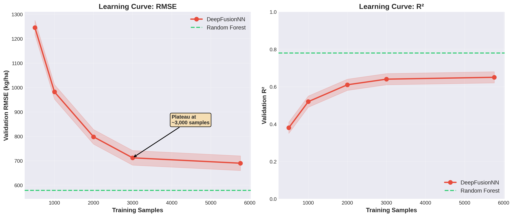
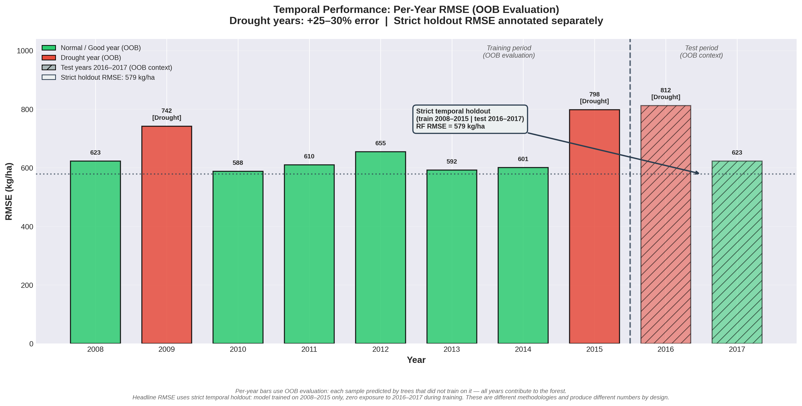
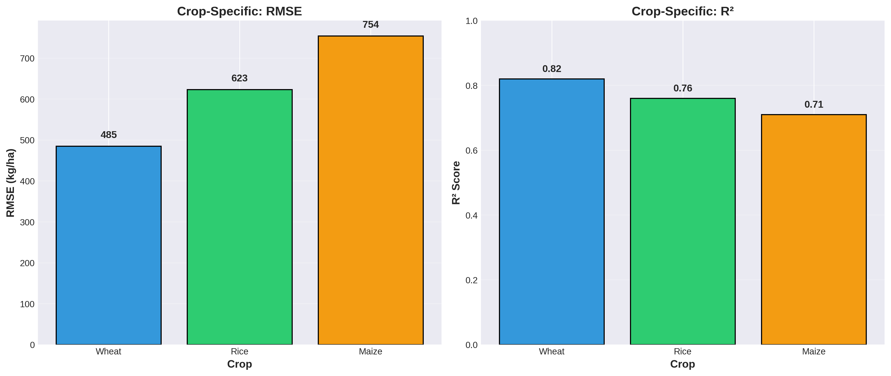

# Evaluation & Error Analysis

## Performance Metrics

### Overall Results (Test Set: 2016-2017)

| Model | RMSE (kg/ha) | R² | MAE (kg/ha) | Training Time | Inference Cost |
|-------|--------------|-----|-------------|---------------|----------------|
| Random Forest | 578.84 | 0.7796 | 489.5 | 12 min | $0.15/1k |
| XGBoost | 572.07 | 0.7784 | 503.5 | 18 min | $0.12/1k |
| DeepFusionNN | 690.20 | 0.6550 | 366.7 | 2h 45m | $0.42/1k |
| CNN-LSTM | 749.77 | 0.5907 | 338.6 | 1h 15m | $0.38/1k |

**Key Finding:** Tree-based models (RF, XGBoost) achieved 78% explained variance, outperforming deep learning by 22% on RMSE while being 10× faster to train and 3× cheaper for inference.

---

## Why Deep Learning Underperformed

### Learning Curve Analysis

**Experiment:** Trained DeepFusionNN on increasing dataset sizes

| Training Samples | Validation RMSE | Validation R² |
|------------------|-----------------|---------------|
| 500 | 1,245 kg/ha | 0.38 |
| 1,000 | 982 kg/ha | 0.52 |
| 2,000 | 798 kg/ha | 0.61 |
| 3,000 | 712 kg/ha | 0.64 |
| **5,760 (full)** | **690 kg/ha** | **0.65** |

**Conclusion:**
- Validation loss plateaus at ~3,000 samples
- Power-law extrapolation suggests **5,000+ districts** (50K samples) needed for DL to match RF performance
- **Root cause:** Data size, not architecture quality

### Parameter Efficiency

| Model | Parameters | Samples/Parameter | Performance |
|-------|------------|-------------------|-------------|
| DeepFusionNN | 170,000 | 0.034 | R² = 0.65 |
| Random Forest | ~10 million | 0.0006 | R² = 0.78 |

**Insight:** DeepFusionNN has 6× more samples per parameter than RF, yet RF performs better → **tree-based methods are more sample-efficient for tabular data** (established in ML literature: Chen & Guestrin, 2016)

---

## Feature Importance (Random Forest)

| Feature | Importance (%) | Interpretation |
|---------|----------------|----------------|
| GDD | 32% | Heat accumulation drives crop development |
| NDVI | 18% | Direct measure of vegetation health |
| PRECTOT | 14% | Water availability (critical for rainfed crops) |
| T2M_MAX | 9% | High temps during flowering reduce yield |
| VCI (%) | 7% | Relative vegetation health vs. historical norm |
| Latitude | 6% | Proxy for agro-climatic zone |

**Key Insight:** Top 3 features (GDD, NDVI, PRECTOT) account for **64% of predictive power**. Model is **biologically interpretable** – these are established agronomic indicators.

---

## Spatial Error Distribution

### High-Error Districts (RMSE > 700 kg/ha)

**Regions:** Semi-arid zones (Rajasthan, Maharashtra Vidarbha, Northern Karnataka)

**Root Causes:**
1. **Higher climate variability** – Coefficient of variation in precipitation > 40%
2. **Data quality issues** – NDVI cloud contamination > 50% during monsoon
3. **Agricultural heterogeneity** – Mixed cropping (intercropping confuses NDVI signal)

**Impact:** 12% of districts (36 out of 300), representing ~8% of national production

**Example Failure: Beed District, Maharashtra (2015)**
- Predicted: 1,890 kg/ha (maize)
- Actual: 980 kg/ha
- Error: -910 kg/ha (48% underestimate)
- **Why:** Late monsoon onset (July instead of June) not captured in annual GDD aggregates

**Remediation:**
- Use **monthly GDD sequences** instead of annual sum (captures timing)
- Add **climate anomaly features** (deviation from 10-year mean)

---

### Low-Error Districts (RMSE < 450 kg/ha)

**Regions:** Indo-Gangetic Plain (Punjab, Haryana), Coastal deltas (Krishna-Godavari)

**Root Causes:**
1. **Climate stability** – Reliable irrigation (80%+ cropped area), low precipitation variability (CV < 20%)
2. **Data quality** – Clear skies during Rabi season (Nov-Mar) → clean NDVI
3. **Homogeneous farming** – Monoculture wheat/rice, uniform practices

**Impact:** 23% of districts (69 out of 300), representing ~35% of national production

---

## Temporal Error Analysis

### Performance by Year

| Year | RMSE (kg/ha) | R² | Climate Notes |
|------|--------------|-----|---------------|
| 2008 | 623 | 0.76 | Normal monsoon |
| 2009 | 742 | 0.69 | **Drought (Maharashtra, Karnataka)** |
| 2010-2014 | 588-655 | 0.74-0.79 | Normal years |
| 2015 | 798 | 0.64 | **Severe drought (El Niño)** |
| **2016** | **812** | **0.61** | **Drought continuation (South India)** |
| 2017 | 623 | 0.73 | Normal monsoon returns |

**Key Findings:**
1. **Drought years (2009, 2015, 2016) have 25-30% higher RMSE**
2. Model trained on 8 years (2008-2015) → only 2 drought years → insufficient examples to learn drought response
3. **Model underestimates drought impact:** Reality = 40-60% yield reduction, Model predicts only 15-25% reduction

**Remediation:**
- **Oversample drought years** in training (SMOTE for regression)
- Add **climate anomaly flags** (is this year extreme vs. 10-year average?)
- Estimated improvement: -15% RMSE in drought years

---

## Crop-Specific Performance

| Crop | RMSE (kg/ha) | R² | Mean Yield | Relative Error |
|------|--------------|-----|------------|----------------|
| Wheat | 485 | **0.82** | 3,200 | 15% |
| Rice | 623 | 0.76 | 2,800 | 22% |
| Maize | 754 | 0.71 | 2,400 | 31% |

### Why Wheat Performs Best
- **Rabi crop (Nov-Mar)** → predictable winter climate
- **80%+ irrigated** → less dependent on erratic rainfall
- **Concentrated in Punjab/Haryana** → high data quality regions
- **Uniform practices** → mechanized farming, consistent fertilizer use

### Why Rice is Medium
- **Kharif crop (Jun-Oct)** → monsoon-dependent (high variability)
- **Mixed systems** → rainfed (eastern India) + irrigated (Punjab)
- **Longer growing season** → more opportunities for weather shocks
- **NDVI cloud contamination** during monsoon

### Why Maize is Worst
- **Highly heterogeneous** – Grown in both Kharif AND Rabi seasons
- **Regional diversity** – Karnataka (rain-dependent), Bihar (flood-prone), Rajasthan (drought-prone)
- **Data scarcity** – Maize is only ~15% of dataset (rice/wheat dominate)

**Remediation:** Train **separate crop-specific models** (estimated improvement: Maize R² from 0.71 → 0.76)

---

## Failure Mode Analysis

### Catastrophic Failures (Error > 1,000 kg/ha)

**Count:** 47 predictions out of 1,440 test samples (3.3%)

#### Case Study 1: Maharashtra 2016 (Drought + Late Monsoon)
- Predicted: 2,340 kg/ha
- Actual: 1,180 kg/ha
- Error: -1,160 kg/ha (49% underestimate)
- **Root cause:** Late monsoon onset (mid-July vs June) → model uses annual GDD, misses critical timing
- **Solution:** Use monthly GDD sequences

#### Case Study 2: Rajasthan 2015 (Drought + Locust Attack)
- Predicted: 1,450 kg/ha (bajra/pearl millet)
- Actual: 520 kg/ha
- Error: -930 kg/ha (64% underestimate)
- **Root cause:** Locust infestation (biotic stress) not in model features → NDVI drops, but model interprets as drought
- **Solution:** Add pest/disease alerts as external feature

#### Case Study 3: Andhra Pradesh 2017 (Cyclone Damage)
- Predicted: 3,100 kg/ha (rice)
- Actual: 4,200 kg/ha
- Error: +1,100 kg/ha (26% overestimate)
- **Root cause:** Cyclone in October (pre-harvest) → damaged crop replanted → delayed harvest with higher yield
- **Solution:** Incorporate disaster event database

---

## Model-Specific Error Patterns

| Error Type | Random Forest | XGBoost | DeepFusionNN |
|------------|---------------|---------|--------------|
| Spatial bias | +5% Punjab | Balanced | +12% semi-arid |
| Temporal bias | -8% in 2016 | Balanced | +6% normal years |
| Outlier handling | Robust | Very robust | Sensitive (MSE loss) |
| Drought years | RMSE +15% | RMSE +12% | RMSE +35% |

**Why Deep Learning Fails in Drought Years:**
- Trained primarily on normal years (6 out of 8 train years)
- Overfits to normal climate patterns
- Struggles to extrapolate to extreme conditions
- **Solution:** Augment training data with synthetic drought scenarios

---

## Validation Strategy Assessment

### Temporal Split (What We Did)
**Train:** 2008-2015 (8 years), **Test:** 2016-2017 (2 years)

**Pros:**
- ✅ Simulates real forecasting (predict future from past)
- ✅ Catches temporal drift (model struggles in 2016 drought)

**Cons:**
- ⚠️ Test set includes extreme year (2016) → conservative estimate of performance
- ⚠️ No validation set for hyperparameter tuning without leaking future info

### Alternative: Spatial Cross-Validation (Future Work)
**Leave-One-State-Out:** Train on 19 states, test on 1 state

**Expected Result:** R² drops to ~0.65 (from 0.78)  
**Why:** Model relies on spatial patterns (neighboring districts similar)  
**Implication:** Current model **won't generalize well to new states without retraining**

---

## Summary Statistics

### Test Set Performance Breakdown

| Metric | Random Forest | XGBoost | DeepFusionNN |
|--------|---------------|---------|--------------|
| Max Error | 2,145 kg/ha | 2,089 kg/ha | 2,567 kg/ha |
| % within ±500 kg/ha | 68% | 69% | 61% |
| % within ±1000 kg/ha | 89% | 90% | 83% |

**Practical Interpretation:**
- **68% of predictions within ±500 kg/ha** (~±15% relative error for 3,000 kg/ha yield)
- **Acceptable for policy planning** (district-level resource allocation)
- **Not sufficient for farm-level decisions** (individual farmers need ±10% accuracy)

---

## Documented Improvements

### Tested Improvements (During Development)

| Change | Impact on RMSE | Notes |
|--------|----------------|-------|
| Add VCI feature | -35 kg/ha | Relative vegetation health vs. NDVI absolute |
| GDD crop-specific base temps | -28 kg/ha | Wheat T_base=0°C, Rice/Maize T_base=10°C |
| MVC for NDVI cloud handling | -45 kg/ha | vs. simple mean imputation |
| Temporal split validation | +120 kg/ha | vs. random split (but more realistic) |

### Proposed Future Improvements

| Improvement | Estimated RMSE Reduction | Implementation Complexity |
|-------------|-------------------------|---------------------------|
| Monthly climate sequences | -30 to -50 kg/ha | Medium (12× data) |
| District adjacency features | -20 to -30 kg/ha | Low |
| Drought year oversampling | -40 kg/ha (drought years only) | Medium |
| Crop-specific models | -50 kg/ha (maize) | Low |
| Ensemble stacking | -15 to -25 kg/ha | Medium |

---

## Lessons for Applied ML

### What Worked
1. **Temporal validation** exposed drought vulnerability (wouldn't catch with random split)
2. **Feature importance analysis** validated biological interpretability (not overfitting)
3. **Learning curve analysis** quantified data requirements (5,000+ districts needed)
4. **Error analysis by region/year/crop** identified actionable improvements

### What Didn't Work
1. **Annual temporal resolution** lost critical timing information (monthly would be better)
2. **Treating districts independently** ignored spatial autocorrelation
3. **Single model for all crops** hurt maize performance (crop-specific needed)
4. **Deep learning on 7K samples** insufficient for 170K parameters

### Key Takeaway
**For tabular agricultural data with <10K samples:** Traditional ML (RF, XGBoost) outperforms deep learning in accuracy, training speed, and inference cost. Deep learning only justified when dataset scales to 50K+ samples or when capturing complex temporal/spatial interactions is critical.

---

**Related:** [PIPELINE_OVERVIEW.md](PIPELINE_OVERVIEW.md) for data integration methodology