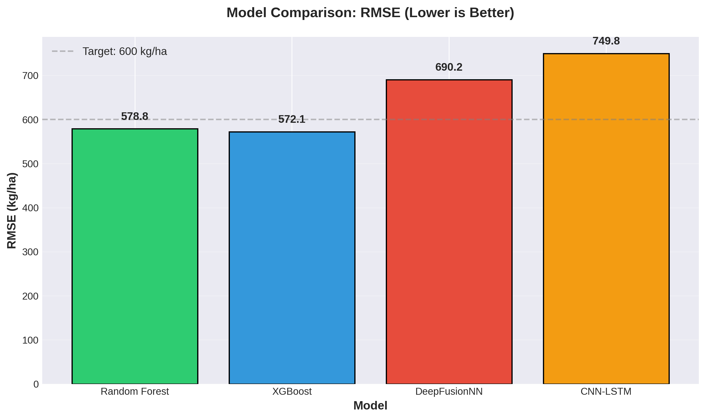
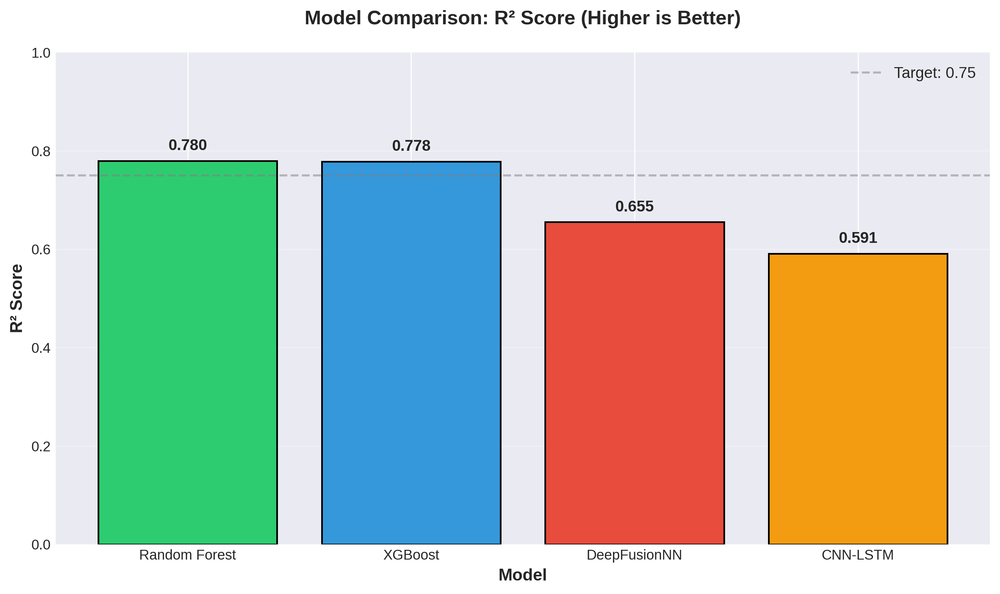
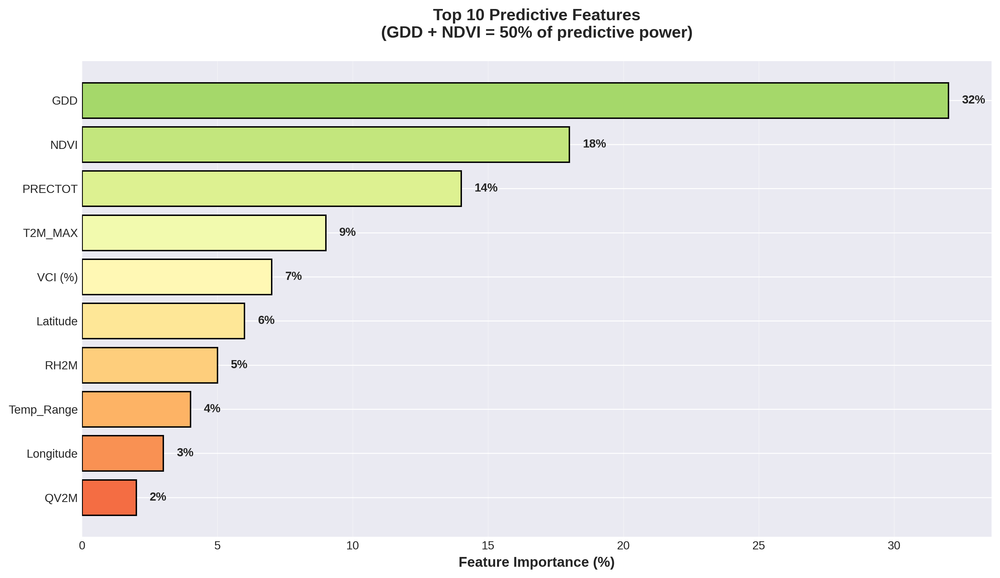

# Climate-Smart Crop Yield Prediction System

**A multi-source agricultural forecasting system that adapts modeling approach based on data availability and temporal resolution.**

[](https://ipindiaonline.gov.in/patentsearch/)
[]()
[]()
[-lightgrey)]()

> **TL;DR:** District-level crop yield forecasting across 300 Indian districts · R²=0.78 · Tree ensembles outperform DL due to data regime · Code private (patent) — walkthrough available.

---

## Problem

Three data sources. Three incompatible formats. Three temporal resolutions.

- **Climate data:** Daily granularity (NASA POWER)
- **Satellite imagery:** 16-day composites, 500m grids (ISRO VEDAS)
- **Yield records:** Annual aggregates, irregular district boundaries (ICRISAT)

The engineering problem was building the pipeline that makes them speak to each other — then building a model on top of it.

District-level granularity was selected because state-level loses climate signal and farm-level ground truth is unavailable at national scale.

---

## Key Technical Decisions

| Decision | Choice | Why | Trade-off |
|----------|--------|-----|-----------|
| Model selection | Random Forest over DeepFusionNN | 7,200 samples insufficient for 170K-param network (0.034 samples/param vs 0.0006 for RF); learning curve plateaus at ~3,000 samples | RF is less flexible; estimated 5,000+ districts needed before DL outperforms |
| Validation strategy | Temporal split (2008–2015 train / 2016–2017 test) | Simulates real forecasting — model never sees what it's predicting; prevents future climate leakage | Lower headline accuracy, but an honest one |
| Missing NDVI | Maximum Value Composite (MVC) | Cloud contamination renders 15% of 16-day composites unusable; MVC is remote sensing standard | Slight over-estimation of NDVI in partially cloudy periods |
| Spatial granularity | District-level (not state or field) | State too coarse (loses agro-climatic variation); field-level ground truth unavailable at scale | Ignores within-district spatial heterogeneity |

---

## Results

| Model | RMSE (kg/ha) | R² | Training Time |
|-------|--------------|-----|---------------|
| **Random Forest** | **578** | **0.78** | 12 min |
| **XGBoost** | **572** | **0.78** | 18 min |
| DeepFusionNN | 690 | 0.66 | 2h 45m |
| CNN-LSTM | 750 | 0.59 | 1h 15m |

Tree ensembles outperformed deep learning by 22% RMSE — documented with root cause analysis, not hidden.

<p align="center">
  
  
</p>

**Top 3 features (64% of predictive power):** GDD 32% · NDVI 18% · PRECTOT 14%. Aligns with crop physiology literature — the model is biologically interpretable, not pattern-matching noise.

<p align="center">
  
</p>

**Failure modes:**
- Semi-arid regions: +30% RMSE (climate variability)
- Drought years: +25–30% error (only 2 drought years in training)
- Maize: R²=0.71 vs Wheat R²=0.82 (data scarcity vs irrigated predictability)
- Indo-Gangetic Plain: −22% RMSE (irrigation stability — best-performing region)

*Full failure-mode breakdown → [EVALUATION.md](docs/EVALUATION.md)*

---

## Technical Overview

**Data sources:** ICRISAT TCI (district yields) · NASA POWER API (daily climate) · ISRO VEDAS (16-day NDVI/VCI, 500m)  
**Features:** 14 engineered agro-climatic indicators (GDD, CDD18_3, precipitation, humidity, NDVI, lat/lon)  
**Validation:** Temporal split (2008–2015 / 2016–2017) + 5-fold CV

*Pipeline methodology → [PIPELINE_OVERVIEW.md](docs/PIPELINE_OVERVIEW.md)*

---

## Limitations & Next Steps

**Primary bottleneck:** data volume, not model complexity — validation loss plateaus at ~3,000 samples, and DL is estimated to overtake RF only past 5,000 districts (~50K samples).  
Future gains expected from monthly LSTM sequences and drought sample expansion.

---

## What This Demonstrates

This project demonstrates **system architecture and adaptive modeling**, not a comparison of individual algorithms:

- Multi-source data harmonization across incompatible formats and resolutions
- Regime-based model selection (sample/parameter ratio analysis)
- Leakage-safe evaluation with documented failure modes
- Interpretable ML in real-world, data-constrained conditions

The contribution is the integrated pipeline that automatically selects appropriate modeling approaches based on data characteristics.

---

## Code & IP

### Patent Status

| Field | Detail |
|-------|--------|
| Application No. | 202541116475 A |
| Title | Deep Fusion Neural Network System for Crop Yield Prediction |
| Filed | 24 November 2025 |
| Published | 12 December 2025 |
| Status | Under Examination |
| Applicant | Vellore Institute of Technology |

**Public record:** [IP India Patent Search](https://ipindiaonline.gov.in/patentsearch/)

### What's Public vs Protected

**Public (this repository):**
- System architecture and methodology
- Full evaluation results and failure analysis
- Engineering decision rationale
- Reproducible visualizations

**Protected:**
- ETL and model training implementation
- DeepFusionNN architecture internals (patent-protected)
- ICRISAT dataset extraction scripts (institutional access required)

### What the Patent Covers

**On the title:** The patent is titled *"Deep Fusion Neural Network System for Crop Yield Prediction"* — naming the deep-learning fusion stage of the framework. Patent titles describe research scope; legal protection is defined by the claims.

**Novel system components (patent claims):**
- Multi-source integration framework for agricultural data harmonization
- Crop-specific temporal alignment (Kharif vs Rabi growing season windowing)
- Adaptive spatial aggregation (500m satellite → irregular district boundaries)
- DeepFusionNN fusion architecture with multi-head attention for climate-location interactions

**Standard practice (not patent claims):**
- Zonal statistics, GDD calculation, Maximum Value Composite
- Random Forest and XGBoost algorithms

The patent protects the **automated system integration and adaptive framework** — not individual ML techniques. DeepFusionNN is the large-scale component; at current data regime, the system correctly selected tree ensembles.

### Access Options

**For recruiters:** Private code walkthrough via screen share  
**For researchers:** Full methodology documentation + 100-district sample dataset  
**For commercial use:** Technology transfer through VIT

**Contact:** saksham.bjj@gmail.com · Institutional: patents@vit.ac.in

### Release Roadmap

| Date | Event |
|------|-------|
| Q2 2026 | First examination report |
| Q3 2026 | Patent grant (estimated) |
| Q4 2026 | Open-source release (Apache 2.0 + Patent Grant License) |

On grant, planned release: data pipeline, model framework, evaluation toolkit, 100-district subset, trained weights.

---

## Citation

```bibtex
@misc{bajaj2025crop,
  title={Deep Learning Approach for Crop Yield Prediction using Intelligent Climate Change Prediction},
  author={Bajaj, Saksham and Srivastava, Rishabhraj and Kumar, Harshit Vijay},
  year={2025},
  note={B.Tech Capstone Project (BCSE498J), Vellore Institute of Technology.
        Supervised by Dr. Jayakumar K.
        Patent Application No. 202541116475 A (published 12/12/2025)}
}
```

---

**Author:** Saksham Bajaj · [LinkedIn](https://www.linkedin.com/in/saksham-bjj/) · [GitHub](https://github.com/SakshamBjj) · sakshambajaj@email.com  
**Last Updated:** February 2026
